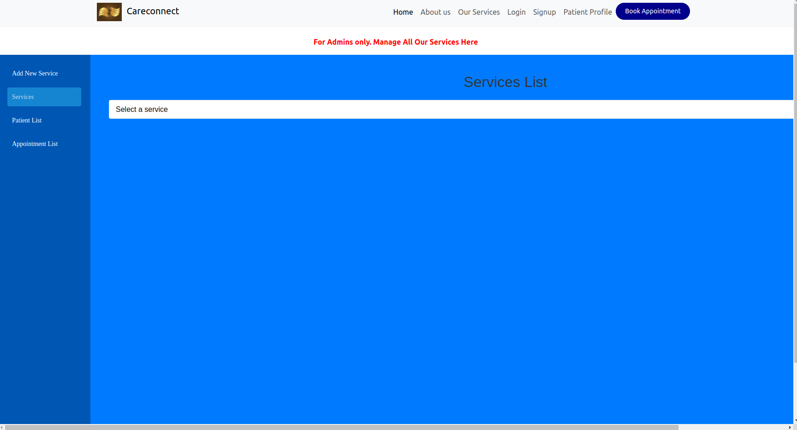
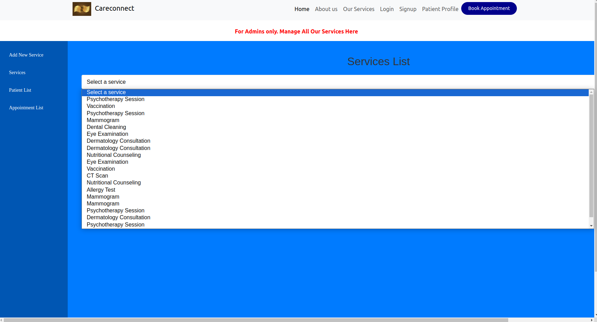
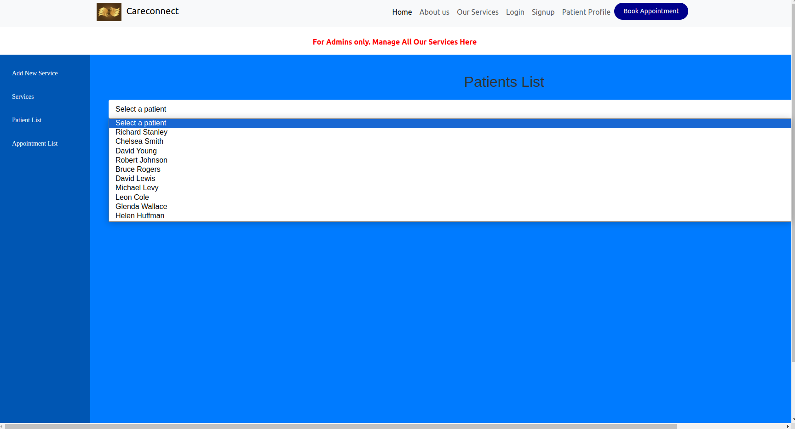
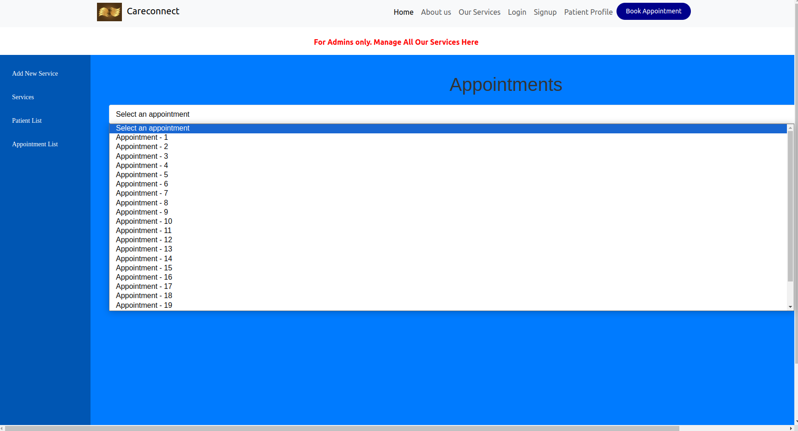
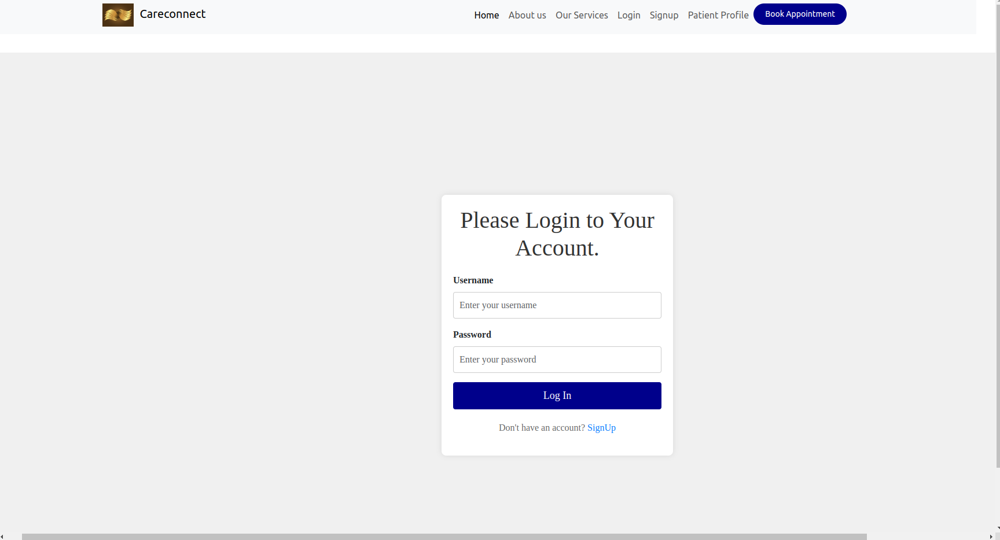

# CARECONNECT APP

  

## Table of Contents
- [Introduction](#introduction)
- [Problem Statement](#problem-statement)
- [Key Features](#key-features)
- [Launching](#launching)
- [MVPs](#mvps)
  - [MVP 1: Service Management](#mvp-1-service-management)
  - [MVP 2: Patient Management](#mvp-2-patient-management)
  - [MVP 3: Appointment Management](#mvp-3-appointment-management)
  - [MVP 4: Patient Login](#mvp-4-patient-login)
  - [Stretch MVPs](#stretch-mvps)
    - [MVP 5: Staff Management](#mvp-5-staff-management)
    - [MVP 6: Billing Services](#mvp-6-billing-services)
- [Technologies Used](#technologies-used)
- [License](#license)
- [Contributors](#contributors)

## Introduction

CareConnect App is a comprehensive healthcare facility application dedicated to providing high-quality medical services to patients. Our mission is to modernize healthcare operations, improve patient care through innovative solutions, and promote a good image and integrity for all healthcare facilities.

## Problem Statement

Many healthcare facilities struggle with efficient management of patient information, appointments, and medical records. Patients are also wary of hidden fees in hospitals and desire a way to see all services received and their current bill. This project provides a way for patients to track their bills. Manual processes are often time-consuming, error-prone, and can lead to miscommunication between departments. This results in longer wait times for patients, increased administrative burden on staff, and potential risks to patient care quality.

## Key Features

- Service Management: Add, delete, and view services offered by the hospital.
- Patient Management: Add, update, delete, and view patient details.
- Appointment Management: Create, delete, and view appointments.
- Patient Login: Patients can log in using credentials provided by the hospital.
- Staff Management: Hospital staff can manage patient appointments and plan accordingly.
- Billing Services: Patients can view a list of all services received and their current bill.

## Launching

Upon opening the application, users will be greeted with a user-friendly interface where they can navigate through different features such as managing services, patients, and appointments.

## MVPs

### MVP 1: Service Management

As a user (with credentials):
- I should be able to get a list of all services offered by the hospital.
- I should be able to delete a hospital service if it is no longer offered.
- I should be able to add services offered by the hospital.

#### Service List

#### Add Services

### MVP 2: Patient Management

Admin should be able to:
- See all patients.
- Update patient details.
- Delete a patient.
- Add a patient with all their details.

#### Patient Management Section

### MVP 3: Appointment Management

As a user (with credentials):
- I should be able to create an appointment.
- I should be able to delete an appointment.
- I should be able to view appointments.

#### Managing Appointments

### MVP 4: Patient Login

- Login page for patients using credentials provided in their hospital account.

#### Logging In

### Stretch MVPs

#### MVP 5: Staff Management

- Based on accrued appointments, hospital staff (e.g., doctors) will be able to know what patients to expect and plan accordingly.

#### MVP 6: Billing Services

As a user:
- I should be able to view a list of all services I have received and my current bill.

## Technologies Used

### Backend
- **Language**: Python, JavaScript (Node.js)
- **Framework**: Flask
- **Database**: MySQL
- **Authentication**: JWT (JSON Web Tokens) or OAuth

### Frontend
- **Language**: JavaScript
- **Framework**: React
- **Routing**: React Router

### Development Tools
- **Version Control**: Git and GitHub
- **Package Management**: npm
- **Build Tools**: Create React App

## License

This project is licensed under the MIT License. See the [LICENSE](LICENSE) file for details.

## Contributors

- [Maurine6](https://github.com/Maurine6)
- [SC-Kenduiwa](https://github.com/SC-Kenduiwa)
- [macharra](https://github.com/macharra)
- [0097eo](https://github.com/0097eo)
- [Ephy](https://github.com/Ephymuiruri)

